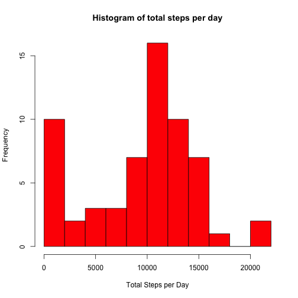
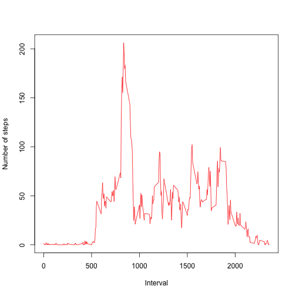
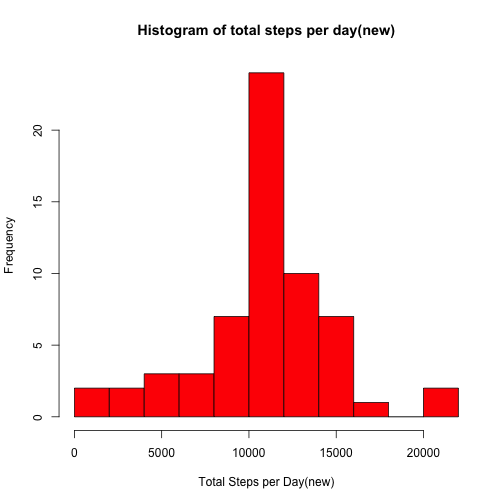
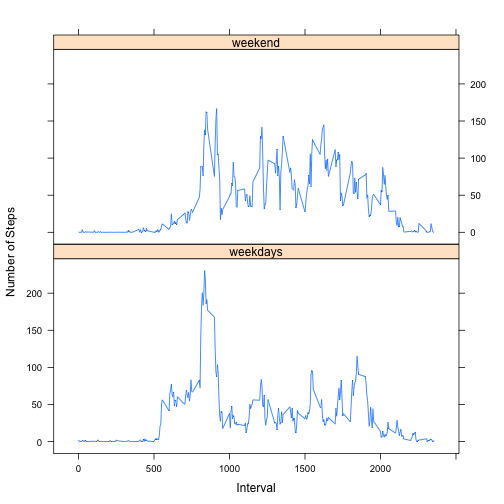

# Loading and preprocessing the data
Load activity.csv and convert the date colume

```r
d1 <- read.csv("./activity.csv")
d1$date <- as.Date(d1$date,"%Y-%m-%d")
```


# What is mean total number of steps taken per day?

```r
d2 <- tapply(d1$steps,d1$date,function(x) sum(x,na.rm=T))
hist(d2,col='red',
     main ='Histogram of total steps per day',
     xlab ='Total Steps per Day',
     breaks= 12)
```

 

```r
meansteps <- mean(d2)
mediansteps <- median(d2)
```
The mean of the total number of steps per day is 9354.2295082, while the median is 10395.

# What is the average daily activity pattern?

```r
d3 <- tapply(d1$steps,d1$interval,mean,na.rm=T)
plot(row.names(d3),d3,
     type="l",
     xlab = "Interval",
     ylab = "Number of steps",
     col="red")
```

 

```r
maxinterval <- names(which.max(d3))
```
The 835 interval contains the maximum number of steps.

# Imputing missing values
Total number of missing values in the dataset

```r
NAs <- sum(!complete.cases(d1))
NAs
```

```
## [1] 2304
```

New dataset filling in all of the missing values

```r
d.new <- d1
na.index <- which(is.na(d1$steps))
imputed.value <- d3[as.character(d1[na.index,"interval"])]
for (i in na.index) {
        interval <- d.new[i,"interval"]
        d.new$steps[i] <- imputed.value[as.character(interval)]
}
```

Histogram of the new total number of steps per day and report the mean and median total number of steps taken per day with the newly imputed values.

```r
d.new2 <- tapply(d.new$steps,d.new$date,sum)
hist(d.new2,col='red',
     main ='Histogram of total steps per day(new)',
     xlab ='Total Steps per Day(new)',
     breaks= 12)
```

 

```r
meansteps.new <- mean(d.new2)
mediansteps.new <- median(d.new2)
```
The mean of the total number of steps per day is 1.0766189 &times; 10<sup>4</sup>, while the median is 1.0766189 &times; 10<sup>4</sup>.


# Are there differences in activity patterns between weekdays and weekends?

Create a new factor variable in the dataset with two levels --"weekdays" and "weekend"

```r
days <- weekdays(d.new$date)
d.new$daytype <- ifelse(days == "Sunday" | days == "Saturday","weekend","weekdays")
```

Make a plot of 5-minute interval and the average number of steps across all weekday days or weekend.

```r
library(lattice)
d.new3 <- aggregate(d.new[,1],
                    list(d.new$interval,d.new$daytype),
                    mean)
names(d.new3) <- c("interval","daytype","steps")

xyplot(steps ~interval | daytype,
       d.new3,
       type = "l",
       layout=c(1,2),
       xlab = "Interval",
       ylab = "Number of Steps")
```

 
